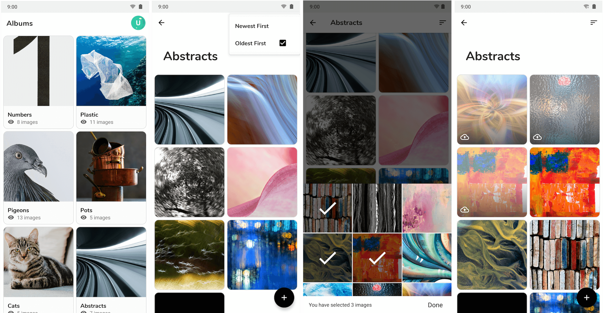

<h3>
Upgur
</h3>

<i>An offline-first Imgur client app that lets you view your albums and photos and upload new ones even if you are offline.</i>

It's a solution to an interview task and mainly consists of my explorations of Android Jetpack. It uses the following components:
- AppCompat
- Lifecycles
- LiveData
- Navigation
- Room
- ViewModel
- WorkManager

### Task description:
- **Login** with Imgur account. Imgur API utilize OAuth2 protocol for Authorization which
means that your application won’t be dealing with user’s credentials directly.
- After obtaining access token and user is logged in, he/she should be redirected to the
new screen - **Albums collection**. Albums should be displayed in a grid layout. Each
album should have thumbnail image or placeholder image, title, privacy indicator and
number of images inside the album, something like the image below.
- When the user taps on particular album, he/she should be able to see all images from
that album (**Images screen**). Images should be displayed in a grid layout. Each image
should be represented by thumbnail image.
- **Upload image** - User should be able to **bulk upload** new images to the particular
album, from the Images screen. Also user should be able to add images to the album in
offline mode, and they should be uploaded automatically once when WiFi connection is
available again. There should be some sort of indicator for images that are still not
uploaded to Imgur. If upload of some image failed user should have ability to retry
upload for that particular image.
- **Sorting** - User should be able to sort all the images by date 1. Latest, 2. Earliest. The
sorting button should be placed as a option menu item when pressed a popup menu
should appear presenting these options.
